<div align="center">

# ◎ MindWave

### AI-Powered Mental Health Platform

**Trained NLP classifiers · PHQ-9/GAD-7 Assessment · Live Dashboard · Crisis Escalation**


[](#-features)
[](#-screenshots)
[](#-how-it-works)
[](#-tech-stack)
[](#-quickstart)
[](#-testing)
[](#-project-structure)
[](#-api-reference)
[](#️-ethics--disclaimer)

</div>

<br>

## 🧠 What is MindWave?

MindWave is a **full-stack AI mental health platform** that uses three trained NLP classifiers to detect emotion, analyse sentiment, and predict distress risk from free-text journal entries — in milliseconds.

Unlike apps that call ChatGPT or use hardcoded rule trees, MindWave **trains its own scikit-learn models** on labelled mental health text data. Every prediction is explainable, auditable, and reproducible by running a single script.

> **Built to address India's mental health crisis** — 0.3 psychiatrists per 100,000 people, ₹2,000–₹8,000 per therapy session, and a 10-year average delay between first symptoms and treatment.

<br>

## 📊 The Problem

<div align="center">

| Statistic | Reality |
|:---:|:---|
| **1 in 4** | people will experience mental illness in their lifetime |
| **75%** | of conditions go completely untreated |
| **10 years** | average delay between first symptoms and receiving help |
| **0.3 per 100k** | psychiatrists available in India |
| **₹7.5 Trillion+** | economic cost of untreated mental illness in India annually |

</div>

MindWave closes this gap with AI that is available 24/7, costs nothing to scale, and carries zero stigma.

<br>

## ✨ Features

### 🤖 AI / NLP Engine

| Feature | Details |
|---|---|
| **Emotion Classifier** | Detects 7 emotions: anxiety, depression, stress, hopeful, calm, anger, loneliness |
| **Sentiment Analyser** | Classifies text as positive, neutral, or negative with confidence scores |
| **Risk Predictor** | Predicts distress level: low / medium / high — triggers crisis escalation |
| **Wellness Scoring** | Composite 0–100 score computed from all three models |
| **Emotion Probabilities** | Full probability distribution across all 7 emotion categories |

### 📋 Clinical Assessment

- **7-question tool** modelled on PHQ-9 (depression) and GAD-7 (anxiety) clinical screening protocols
- Each answer scored 0–3, total out of 21, mapped to four wellness levels
- Interactive step-by-step flow with live progress tracking
- Results automatically saved to journal history and reflected in dashboard charts
- Previous assessment history shown in sidebar for trend tracking

### 📊 Personal Dashboard

- **Wellness Score Trend** — live line chart from your actual journal entries
- **Emotion Distribution** — donut chart of your personal emotional profile over time
- **Daily Check-in Trends** — bar chart tracking mood, sleep hours, and stress levels
- **Active Streak Counter** — tracks consecutive days of engagement
- **Recent Journal Entries** — quick-access sidebar with AI tags and scores

### 🔐 Privacy & Security

- SHA-256 password hashing — credentials never stored in plaintext
- Per-user SQLite data isolation — you only ever see your own data
- All data stored locally — no third-party cloud sync
- One-click account deletion
- Session-based authentication with stale session protection

### 🚨 Crisis Escalation

- High-risk journal entries automatically surface India helpline numbers
- Assessment results trigger escalation protocol when score crosses threshold
- iCall: **9152987821** · Vandrevala Foundation: **1860-2662-345**

<br>

## 📸 Screenshots

<div align="center">

### Landing Page
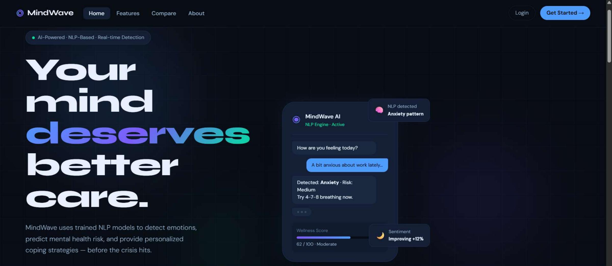

*"Your mind deserves better care." — NLP engine active, wellness score shown in real-time chat mockup*

<br><br>

### How It Works
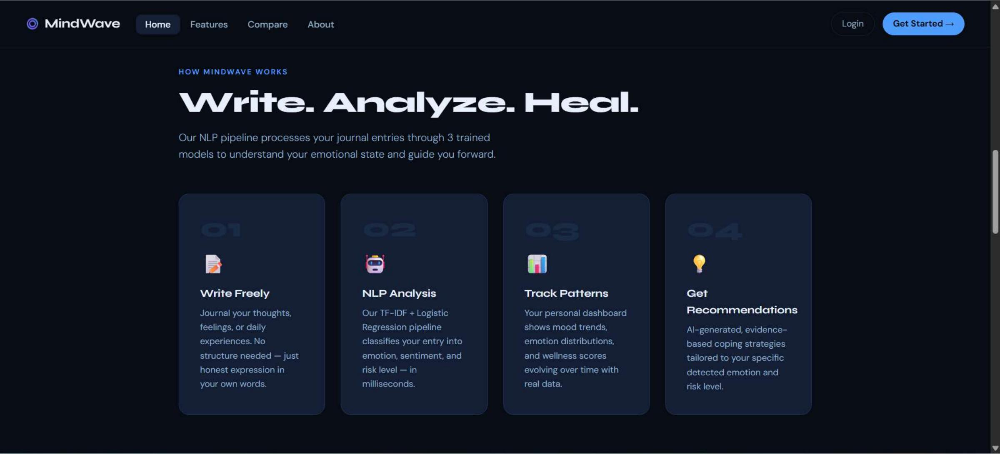

*4-step pipeline: Write Freely → NLP Analysis → Track Patterns → Get Recommendations*

<br><br>

### NLP Engine — 3 Trained Models
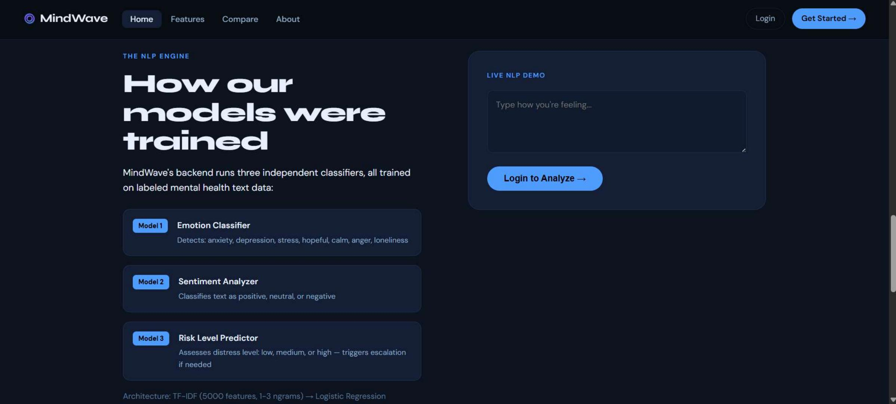

*Model 1: Emotion (7 classes) · Model 2: Sentiment (3 classes) · Model 3: Risk (3 levels) — all trained with TF-IDF + Logistic Regression*

<br><br>

### AI Journal — Live Analysis Result
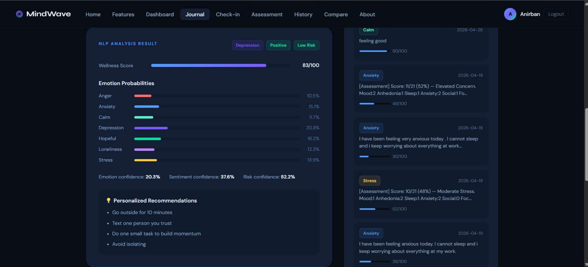

*Real NLP output: emotion detected as Depression · Positive sentiment · Low Risk · Wellness 83/100 · Full probability distribution across all 7 emotions*

<br><br>

### 7-Question Clinical Assessment
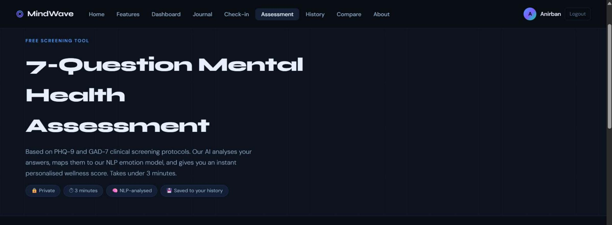

*Based on PHQ-9 and GAD-7 clinical protocols — Private · 3 minutes · NLP-analysed · Saved to history*

<br><br>

### Assessment Result
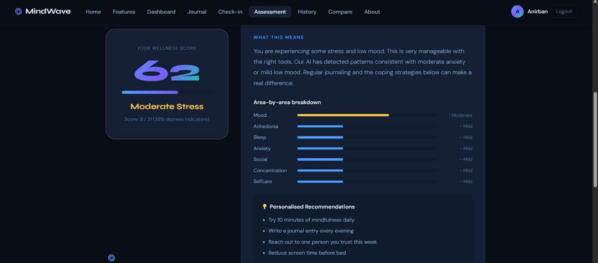

*Wellness score 62 · Moderate Stress · Area-by-area breakdown · Personalised recommendations*

<br><br>

### Personal Dashboard
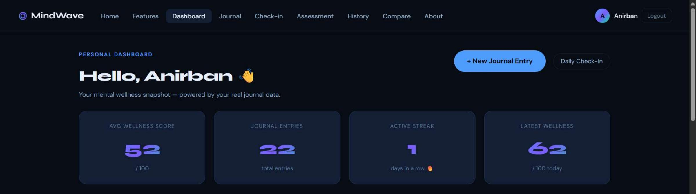

*Hello, Anirban 👋 — Avg Wellness: 52 · Journal Entries: 22 · Active Streak: 1 🔥 · Latest: 62/100*

<br><br>

### Dashboard Charts
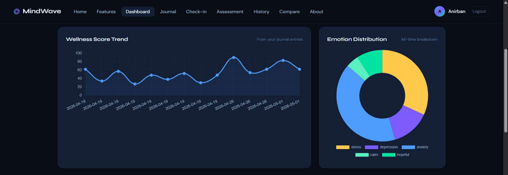

*Wellness Score Trend (line chart) + Emotion Distribution (donut chart) — both driven by real journal data*

<br><br>

### Daily Check-in
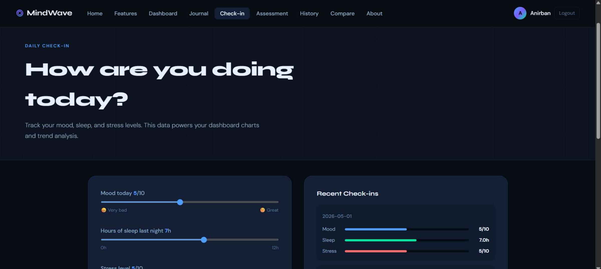

*Log mood (5/10), sleep hours (7h), and stress level (5/10) — data feeds directly into dashboard bar charts*

<br><br>

### History — All Entries
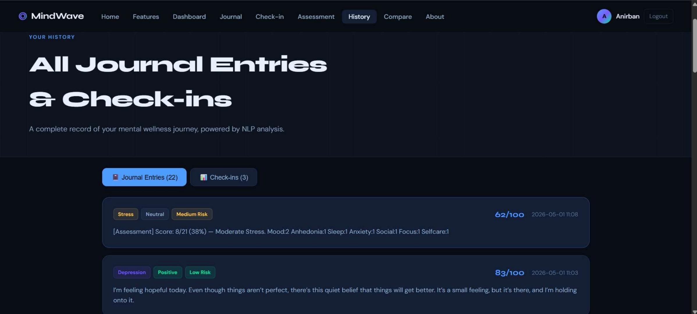

*22 Journal Entries + 3 Check-ins — each tagged with emotion, sentiment, risk level, wellness score, and timestamp*

<br><br>

### Features Overview
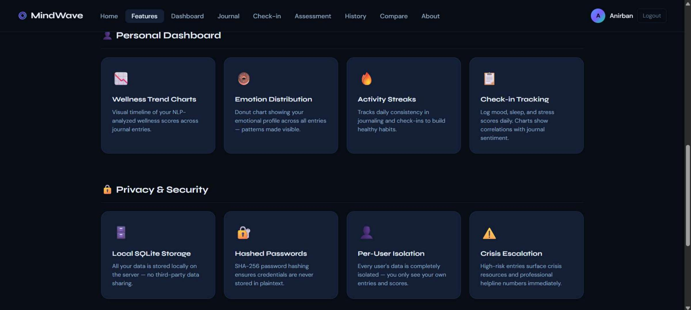

*Full platform capability breakdown, grouped by category*

<br><br>

### About & Ethics
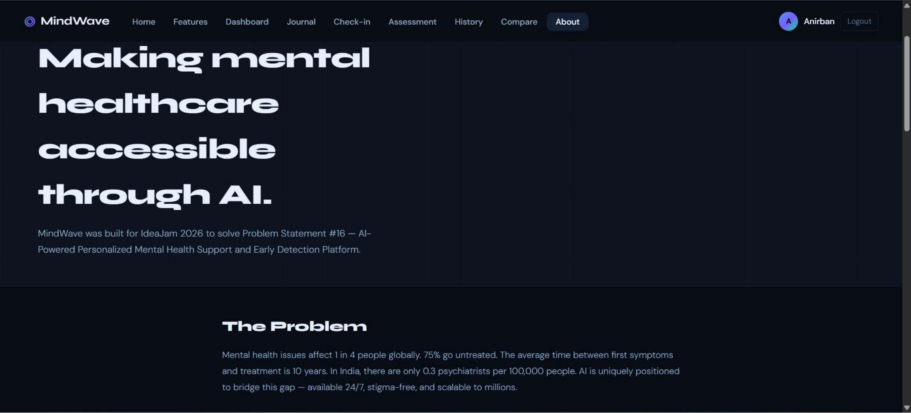

*Mission, tech stack, and ethical commitments behind MindWave*

</div>

<br>

## 🔬 How It Works

```
User writes journal entry / takes assessment
          ↓
preprocess() — lowercase · strip URLs · remove symbols
          ↓
TF-IDF Vectorizer — text → 5,000-number feature vector (1–3 ngrams)
          ↓
┌─────────────────────────────────────────────┐
│  emotion_clf.predict()   →  "anxiety"       │
│  sentiment_clf.predict() →  "negative"      │  ← 3 models fire in parallel
│  risk_clf.predict()      →  "medium"        │
└─────────────────────────────────────────────┘
          ↓
wellness_score = max(10, min(100, base + sentiment_bonus + risk_penalty))
          ↓
INSERT INTO journals (user_id, text, emotion, sentiment, risk, wellness_score)
          ↓
/api/dashboard_data → JSON → Chart.js redraws all charts instantly
```

### Model Training Pipeline

```
# 1. Dataset: labelled mental health samples (augmented)
# 2. Preprocessing: lowercase, URL removal, special char stripping
# 3. Vectorization: TF-IDF (5000 features, 1-3 ngrams, sublinear TF)
# 4. Classification: Logistic Regression (balanced class weights, max_iter=500)
# 5. Output: 3 .pkl model files + label encoders + metadata saved with joblib

python model/train_model.py   # run this to reproduce all models
```

**Three models trained:**

| Model | Task | Classes | Architecture |
|---|---|---|---|
| `emotion_classifier.pkl` | Emotion detection | 7 (anxiety, depression, stress, hopeful, calm, anger, loneliness) | TF-IDF → LogReg |
| `sentiment_classifier.pkl` | Sentiment analysis | 3 (positive, neutral, negative) | TF-IDF → LogReg |
| `risk_classifier.pkl` | Risk prediction | 3 (low, medium, high) | TF-IDF → LogReg |

<br>

## 🛠 Tech Stack

| Layer | Technology | Purpose |
|---|---|---|
| **Backend** | Python 3.9+, Flask 3.0 | Server, routing, auth, REST API |
| **AI / ML** | scikit-learn, TF-IDF, Logistic Regression | NLP classifiers trained from scratch |
| **Database** | SQLite (via `sqlite3`) | Per-user relational storage |
| **Frontend** | HTML5, CSS3, JavaScript | Responsive UI |
| **Templates** | Jinja2 | Server-side rendering |
| **Charts** | Chart.js 4.4 | Live interactive dashboard |
| **Auth** | SHA-256, Flask sessions | Secure login / logout |
| **Persistence** | joblib | Save & load trained model files |
| **Testing** | pytest, pytest-cov | Unit & integration test suite |

<br>

## ⚡ Quickstart

### Prerequisites

- Python 3.9 or higher
- pip

### 1. Clone the repository

```bash
git clone https://github.com/Akundu007-rgb/mindwave-ai.git
cd mindwave-ai
```

### 2. Create and activate a virtual environment

```bash
# Windows
python -m venv .venv
.venv\Scripts\activate

# Mac / Linux
python -m venv .venv
source .venv/bin/activate
```

### 3. Install dependencies

```bash
python -m pip install --upgrade pip
python -m pip install -r requirements.txt
```

### 4. Train the NLP models

> **This step is required before running the app.** It trains all 3 classifiers and saves the `.pkl` files.

```bash
python model/train_model.py
```

You will see accuracy reports printed for each model. This takes about 10–15 seconds.

### 5. Run the app

```bash
python app.py
```

### 6. Open in browser

```
http://127.0.0.1:5000
```

Register a free account, write your first journal entry, and watch the AI analyse it in real time.

<br>

## 🧪 Testing

MindWave ships with a `pytest` suite covering authentication, models, and API endpoints.

```bash
python -m pip install pytest pytest-cov
python -m pytest
```

Run with coverage:

```bash
python -m pytest --cov=. --cov-report=html
```

See [`TESTS_README.md`](TESTS_README.md) for a full breakdown of what each test module covers.

| Test File | Covers |
|---|---|
| `tests/test_auth.py` | Registration, login, logout, session handling |
| `tests/test_models.py` | NLP classifier loading & prediction correctness |
| `tests/test_api.py` | `/api/analyze`, `/api/dashboard_data` endpoints |
| `tests/conftest.py` | Shared fixtures (test client, test DB) |

<br>

## 📁 Project Structure

```
mindwave-ai/
│
├── app.py                        ← Flask application (routes, auth, NLP API)
├── requirements.txt              ← Python dependencies
├── pytest.ini                    ← pytest configuration
├── README.md
├── TESTS_README.md               ← Test suite documentation
│
├── model/
│   ├── train_model.py            ← 🔑 NLP training script (run this first)
│   ├── model_meta.json           ← Model metadata (accuracy, classes, version)
│   ├── tfidf_vectorizer.pkl      ← Generated after training
│   ├── emotion_classifier.pkl    ← Generated after training
│   ├── sentiment_classifier.pkl  ← Generated after training
│   ├── risk_classifier.pkl       ← Generated after training
│   └── label_encoders.pkl        ← Generated after training
│
├── data/                         ← Training datasets (gitignored, large files)
│
├── templates/
│   ├── base.html                 ← Master template (nav, footer)
│   ├── index.html                ← Landing page
│   ├── login.html                ← Login page
│   ├── register.html             ← Registration page
│   ├── dashboard.html            ← Personal dynamic dashboard
│   ├── journal.html              ← AI journal + analysis result
│   ├── checkin.html              ← Daily check-in sliders
│   ├── assessment.html           ← 7-question clinical assessment
│   ├── history.html              ← Full entry history
│   ├── features.html             ← Platform features
│   └── about.html                ← Mission, tech stack, ethics
│
├── static/
│   ├── css/
│   │   └── main.css              ← Full design system (dark theme, responsive)
│   └── js/
│       └── main.js               ← Animations, chart fetching, form logic
│
├── tests/
│   ├── __init__.py
│   ├── conftest.py                ← Shared pytest fixtures
│   ├── test_api.py                ← API endpoint tests
│   ├── test_auth.py               ← Auth flow tests
│   └── test_models.py             ← NLP model tests
│
├── instance/
│   └── mindwave.db                ← SQLite database (auto-created, gitignored)
│
└── screenshots/                   ← App screenshots for README
```

<br>

## 🌐 Pages & Routes

| Route | Auth | Description |
|---|---|---|
| `GET /` | Public | Landing page with NLP demo |
| `GET/POST /register` | Public | Create account |
| `GET/POST /login` | Public | Login |
| `GET /logout` | — | Clear session |
| `GET /dashboard` | ✅ | Personal dashboard with live charts |
| `GET/POST /journal` | ✅ | Write entry, get instant AI analysis |
| `GET/POST /checkin` | ✅ | Log daily mood, sleep, stress |
| `GET/POST /assessment` | ✅ | 7-question PHQ-9/GAD-7 assessment |
| `GET /history` | ✅ | All journal entries and check-ins |
| `GET /features` | Public | Platform feature overview |
| `GET /about` | Public | Mission, architecture, ethics |

<br>

## 📡 API Reference

### `POST /api/analyze`

Analyse any text with all 3 NLP models.

**Request:**

```json
{ "text": "I have been feeling very anxious lately" }
```

**Response:**

```json
{
  "emotion": "anxiety",
  "sentiment": "negative",
  "risk_level": "medium",
  "wellness_score": 45,
  "emotion_distribution": {
    "anxiety": 62.3,
    "depression": 15.1,
    "stress": 11.2,
    "hopeful": 4.8,
    "calm": 3.5,
    "anger": 2.1,
    "loneliness": 1.0
  },
  "confidence": {
    "emotion": 62.3,
    "sentiment": 78.5,
    "risk": 71.2
  },
  "recommendations": [
    "Try 4-7-8 breathing",
    "Ground yourself with 5-4-3-2-1 senses",
    "Write your worries down"
  ]
}
```

### `GET /api/dashboard_data`

Returns all chart data for the logged-in user.

**Response:**

```json
{
  "mood_trend": [
    { "date": "2026-04-19", "score": 60 },
    { "date": "2026-04-26", "score": 83 }
  ],
  "checkin_trend": [
    { "date": "2026-05-01", "mood": 5, "sleep": 7.0, "stress": 5 }
  ],
  "emotion_counts": {
    "anxiety": 8,
    "stress": 6,
    "depression": 4,
    "hopeful": 3,
    "calm": 1
  },
  "stats": {
    "avg_wellness": 52,
    "avg_mood": 5.0,
    "avg_sleep": 7.0,
    "journal_count": 22,
    "streak": 1
  }
}
```

<br>

## 🗄 Database Schema

```sql
CREATE TABLE users (
    id        INTEGER PRIMARY KEY AUTOINCREMENT,
    username  TEXT UNIQUE NOT NULL,
    email     TEXT UNIQUE NOT NULL,
    password  TEXT NOT NULL,           -- SHA-256 hashed
    created   TEXT NOT NULL
);

CREATE TABLE journals (
    id             INTEGER PRIMARY KEY AUTOINCREMENT,
    user_id        INTEGER NOT NULL,   -- FK → users.id
    text           TEXT NOT NULL,
    emotion        TEXT,               -- anxiety | depression | stress | ...
    sentiment      TEXT,               -- positive | neutral | negative
    risk_level     TEXT,               -- low | medium | high
    wellness_score INTEGER,            -- 0–100
    created        TEXT NOT NULL
);

CREATE TABLE checkins (
    id           INTEGER PRIMARY KEY AUTOINCREMENT,
    user_id      INTEGER NOT NULL,
    mood_score   INTEGER NOT NULL,     -- 1–10
    sleep_hours  REAL,                 -- 0–12
    stress_level INTEGER,              -- 1–10
    notes        TEXT,
    created      TEXT NOT NULL
);
```

<br>

## ⚙️ Requirements

```
flask>=3.0.0
scikit-learn>=1.3.0
numpy>=1.24.0
pandas>=2.0.0
joblib>=1.3.0
pytest>=7.4.0
pytest-cov>=4.1.0
```

Install with:

```bash
python -m pip install -r requirements.txt
```

<br>

## ⚠️ Ethics & Disclaimer

> MindWave is an **educational research prototype** built for IdeaJam 2026.

- ❌ **Not a medical device** — does not diagnose or treat any condition
- ❌ **Not a substitute** for professional mental health care
- ✅ AI escalates to human professionals when risk is high
- ✅ All recommendations follow evidence-based CBT principles
- ✅ Users are always informed they are interacting with AI, not a therapist
- ✅ NLP models are trained on a synthetic dataset — real-world accuracy will vary

### 🆘 Crisis Resources (India)

If you or someone you know is in crisis:

| Service | Number | Hours |
|---|---|---|
| **iCall** | 9152987821 | Mon–Sat, 8am–10pm |
| **Vandrevala Foundation** | 1860-2662-345 | 24/7 |
| **Emergency Services** | 112 | 24/7 |

<br>

## 🗺 Roadmap

- [x] Phase 1 — Prototype: Flask + SQLite + 3 NLP models + auth + dashboard + assessment
- [x] Phase 1 — Test suite: pytest coverage for auth, models, API
- [ ] Phase 2 — Upgrade: BERT/transformer model for improved accuracy
- [ ] Phase 2 — Mobile: React Native app
- [ ] Phase 3 — Platform: Therapist marketplace + telemedicine integration
- [ ] Phase 3 — Compliance: MoHFW digital health + DPDP Act certification
- [ ] Phase 4 — Scale: B2B corporate wellness · 1M+ users target

<br>

<div align="center">

## 👨‍💻 Author

**Anirban Kundu**

B.Tech Computer Science and Engineering · Aspiring AI Engineer

[](https://github.com/Akundu007-rgb)

<br>

## 📄 License

This project is licensed under the **MIT License** — see the [LICENSE](LICENSE) file for details.

<br>

### MindWave — Turning words into wellness.

*Made with ❤️ using AI for better mental health.*

</div>
